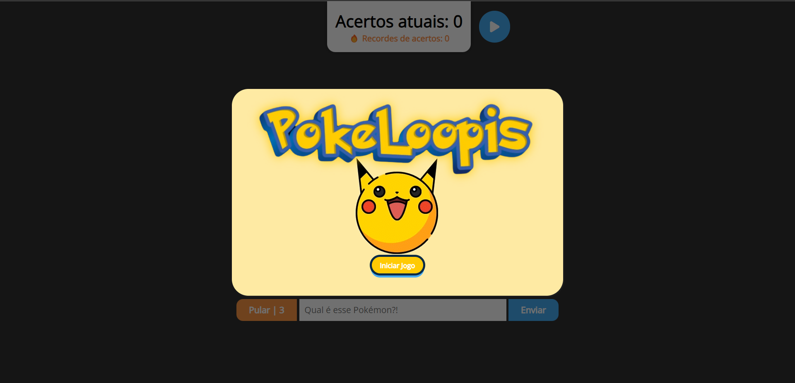
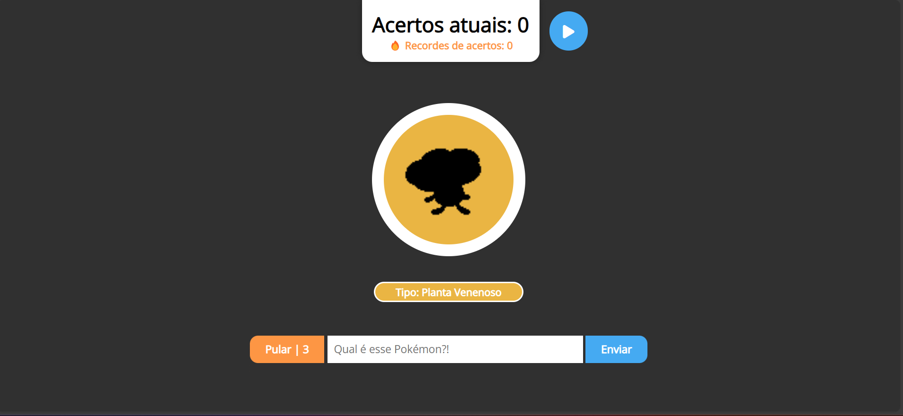
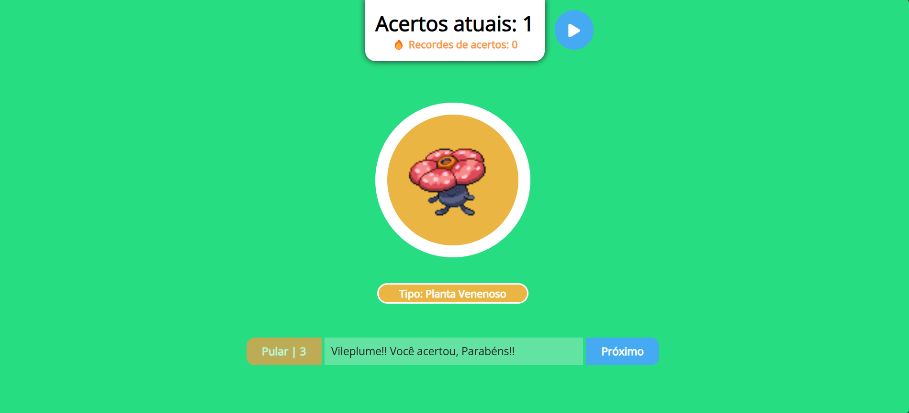
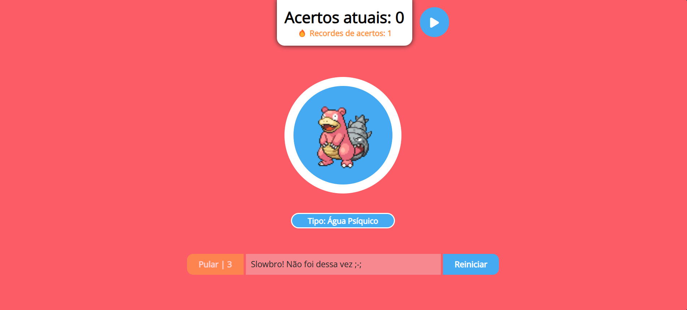

# PokeLoopis

Bem-vindo ao Pokémon Guessing Game! Este é um emocionante projeto de aplicação web de adivinhação de Pokémon, criado como parte do processo seletivo da empresa júnior Loopis. Desenvolvido com dedicação, este jogo oferece uma experiência envolvente para os fãs ávidos de Pokémon.

## 📷 Screenshots

### Tela inicial ✨

### Aguardando Resposta do Usuário 🤔

### Resposta Correta ✅

### Resposta Incorreta ❌

## Como Jogar 🎮

- Abra o arquivo index.html em seu navegador.
- Clique na caixa de texto e insira o nome do Pokémon que você acha que está na imagem.
- Pressione "Enviar" para verificar se a resposta está correta.
- Use o botão "Pular" para pular para o próximo Pokémon, se necessário.
- Acompanhe seu placar e seu recorde na parte superior da tela.
- Aproveite a experiência autêntica de adivinhar Pokémon!

## Funcionalidades 🎮

1. Adivinhe o Pokémon
  - O jogo permite que o usuário adivinhe o nome do Pokémon exibido na tela.
  - Se o usuário acertar, o número de acertos é incrementado, e a imagem do Pokémon é revelada.
  - Se o usuário errar, o placar é zerado, e o usuário deve reiniciar a partida.
2. Pule um Pokémon
  - Os jogadores têm a opção de pular um Pokémon se não souberem a resposta.
  - No entanto, eles estão limitados a pular apenas três vezes durante uma partida.
3. Local Storage
  -  O jogo armazena informações no Local Storage do navegador.
  - Isso inclui o recorde de acertos em partidas anteriores.
  - Mesmo se a página for atualizada, as informações da partida anterior ainda estarão disponíveis.
4. Efeito de Filtro
  - Durante a partida, a imagem do Pokémon é exibida com um filtro que a torna totalmente escura.
  - O filtro só é removido após um acerto, revelando a imagem original do Pokémon.
  - Os tipos relacionados ao Pokémon também têm cores diferentes para uma experiência mais autêntica.
5. Música Temática
  - A aplicação oferece a opção de reproduzir a música temática do desenho Pokémon.
  - Os jogadores podem escolher se desejam ou não ouvir a música enquanto jogam.

## 🤝 Contribuição

Contribuições são bem-vindas! Sinta-se à vontade para abrir issues e enviar pull requests.

## Equipe do Projeto 👥
Este projeto foi desenvolvido com a colaboração e dedicação de uma equipe talentosa. Conheça as pessoas por trás do Pokémon Guessing Game:

Diogo Santana Freitas - [dxxiogo](https://github.com/dxxiogo)  
Douglas da Silva Araújo - [7-Dodi](https://github.com/7-Dodi)  
João Pedro Oliveira Santos - [JoaoPedroli](https://github.com/JoaoPedroli)  

Desenvolvido com ❤️ pela equipe San Andreas.
